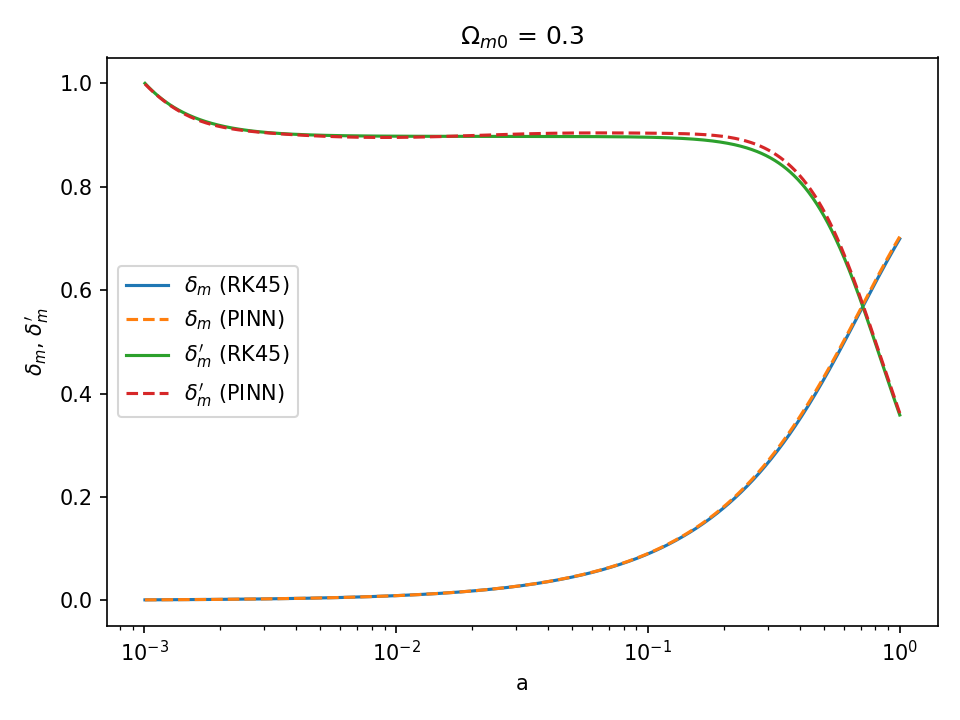
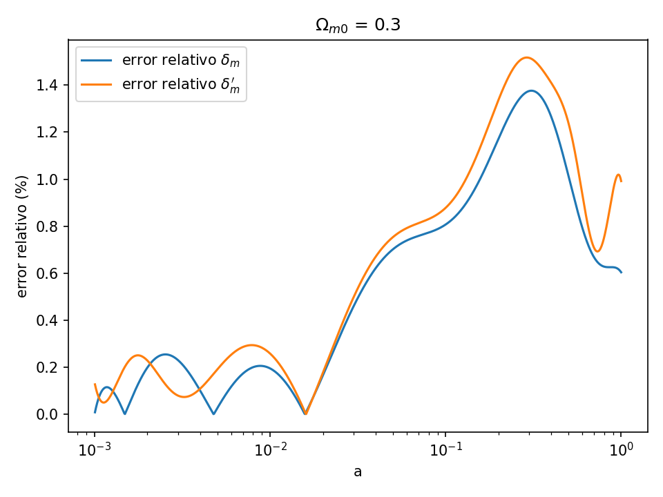
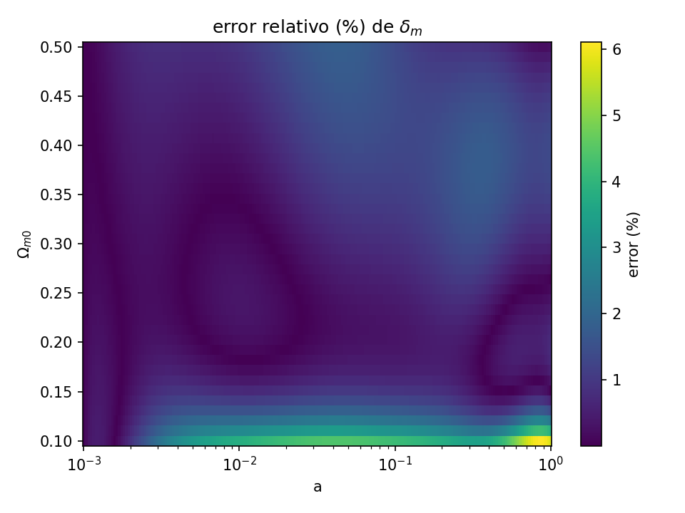

# Perturbaciones de materia con una Red Neuronal Informada por Física (PINN)

Una red neuronal, entrenada sin datos, que aprende a resolver una ecuación diferencial en vez de resolverla una vez por cada configuración de parámetros.



## El problema: evolución de estructuras a gran escala

En cosmología, la forma en que se agrupa la materia en el universo —el origen de las galaxias— sigue una ecuación diferencial de segundo orden. Para poner a prueba un modelo cosmológico contra observaciones hay que resolver esa ecuación reiteradamente: una vez por cada combinación de parámetros que se quiere explorar, y en la práctica eso conlleva un alto costo computacional (es necesario ajustar parámetros, analizar estabilidad).

Resolverla con un integrador numérico (Runge-Kutta) es exacto pero hay que repetirlo cada vez que se cambia algun parámetro.

## La idea: entrenar una vez

En vez de resolver la ecuación una vez por parámetro, se entrena una red que aprenda **la familia completa de soluciones** de una sola vez: no `δ(a)` para un `Ω_m0` fijo, sino `δ(a, Ω_m0)` para todo un rango de `Ω_m0` simultáneamente (esto se conoce como *bundle solution*).

No hay datos de entrenamiento. La función de costo es directamente el residuo al cuadrado de la ecuación diferencial, promediado sobre puntos muestreados del dominio — la red aprende a cumplir con la física, no a interpolar ejemplos.

Una vez entrenada, evaluarla para un `Ω_m0` nuevo es un forward pass, rápido a comparación de correr el integrador numérico.

## Resultados

Repo con dos redes entrenadas y commiteadas en `models/`:

- **`single_om030`**: red no-bundle, `Ω_m0 = 0.3` fijo.
- **`bundle_om_010_050`**: red bundle, `Ω_m0 ∈ [0.1, 0.5]`.

Validadas contra un integrador RK45 de referencia (solve_ivp de Scipy en `cosmopinn/reference.py`).





## Cómo correrlo

```bash
python -m venv .venv && source .venv/bin/activate
pip install -r requirements.txt

pytest -q                                          # tests contra los pesos ya commiteados

python scripts/train_single.py                     # entrena Ω_m0 fijo (~1-2 min en CPU)
python scripts/train_bundle.py                      # entrena el bundle (~15 min en CPU)
python scripts/validate.py --run models/bundle_om_010_050
```

El notebook `notebooks/perturbaciones_pinn.ipynb` muestra el flujo de configuración, entrenamiento y validación de los resultados usando los pesos ya entrenados (corre en menos de un minuto, sin reentrenar nada).

## Cómo está validado

- Contra un integrador numérico (`scipy.solve_ivp`, RK45) que resuelve la misma ecuación sin ningún cambio de variables.
- `cosmopinn/cosmology.py`  contiene los paramétros del fondo cosmológico: tanto la red como el solver de referencia llaman a las mismas funciones, así que no hay dos físicas ligeramente distintas escondidas en dos archivos.
- Tests automáticos (`pytest`, corren en CI en cada push): límites físicos de la cosmología de fondo, sanidad del integrador de referencia, y un test de regresión que carga los pesos commiteados y verifica el error contra la referencia.

## Qué hay adentro

```
matter_perturbations_project/
├── cosmopinn/
│   ├── cosmology.py     # fondo ΛCDM: E(a)², d(ln H)/dN
│   ├── equation.py      # cambio de variables + residuo de la ODE
│   ├── training.py      # arma la red y el solver de neurodiffeq, entrena, guarda
│   ├── reference.py      # solución de referencia (scipy.solve_ivp)
│   └── evaluate.py       # carga un run entrenado, métricas de error
├── scripts/
│   ├── train_single.py   # Ω_m0 fijo
│   ├── train_bundle.py   # bundle en Ω_m0
│   └── validate.py       # PINN vs referencia
├── models/                # pesos ya entrenados (nets.pth, config.json, loss.npy)
├── figures/                # figuras usadas en este README
├── notebooks/              # notebook narrado, punta a punta
└── tests/
```

## Limitaciones y qué sigue

Este repo muestra el método en su forma más simple: el modelo cosmológico estándar (ΛCDM) y un parámetro del bundle (`Ω_m0`). Es una parte de mi trabajo de tesis, la cual extiende la misma idea a gravedad modificada (`f(R)`, modelo de Hu-Sawicki) y a un espacio de 4 parámetros del bundle. Todo eso está en producción.
## Contexto

Extracto de mi tesis de licenciatura en Física, sobre Physics-Informed Neural Networks aplicadas a cosmología. Reescrito desde cero para ser legible y autocontenido — la física es la misma, el código no es una copia del repo de tesis.

Construido con [PyTorch](https://pytorch.org/) y [neurodiffeq](https://github.com/NeuroDiffGym/neurodiffeq).
